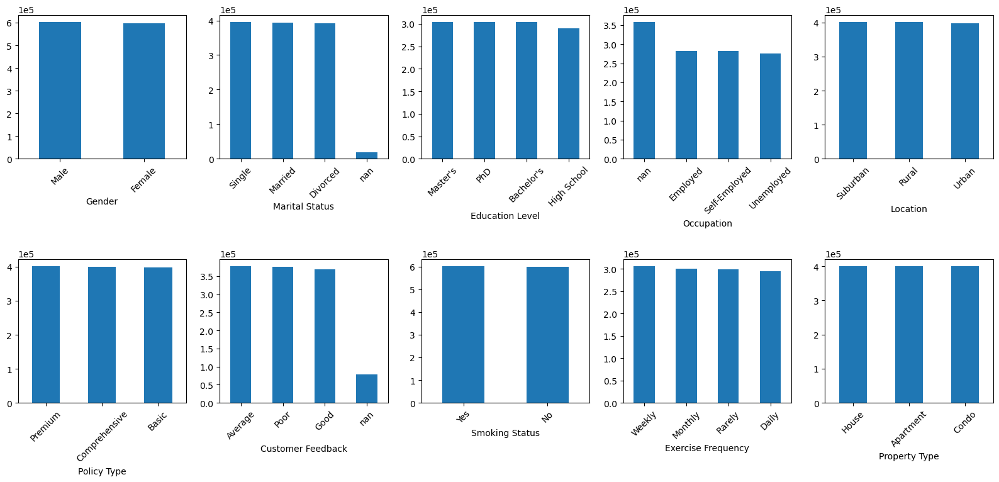
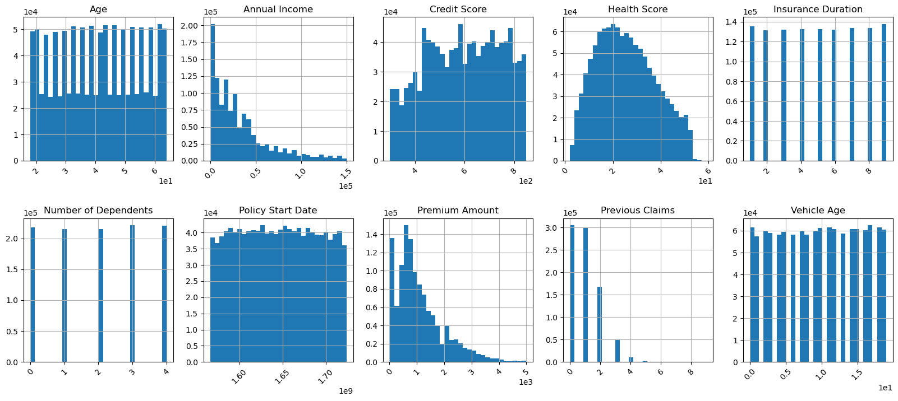
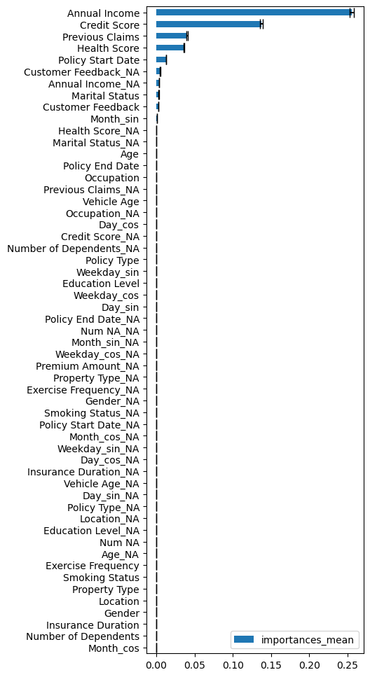
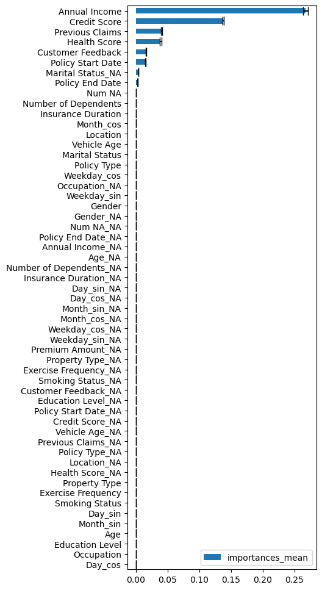

```python
import numpy as np
import pandas as pd
import seaborn as sns
import matplotlib.pyplot as plt
from sklearn.preprocessing import StandardScaler, RobustScaler, MinMaxScaler, QuantileTransformer
from sklearn.model_selection import GridSearchCV, train_test_split, StratifiedKFold
from sklearn.pipeline import Pipeline
from sklearn.linear_model import LassoCV, Ridge, SGDRegressor
from sklearn.metrics import root_mean_squared_log_error, root_mean_squared_error
from sklearn.tree import DecisionTreeRegressor
from sklearn.ensemble import RandomForestRegressor, AdaBoostRegressor, BaggingRegressor, StackingRegressor, GradientBoostingRegressor, HistGradientBoostingRegressor
from sklearn.naive_bayes import GaussianNB
from sklearn.svm import LinearSVR
import xgboost as XGB
import lightgbm as lgb
import scipy.stats as stats
from datetime import datetime
from sklearn.model_selection import cross_val_score
from sklearn.feature_selection import SequentialFeatureSelector, RFE, RFECV
from sklearn.inspection import permutation_importance
```

Importing training, testing datasets. 
Training set consists of 1.2 million samples and 20 features including Premium Amount
Test set consists of 800,000 samples


```python
df = pd.read_csv('dataset/train.csv',index_col=0)
df_test = pd.read_csv('dataset/test.csv',index_col=0)
print('training data shape:',df.shape)
print('test data shape:',df_test.shape)
```

    training data shape: (1200000, 20)
    test data shape: (800000, 19)
    

## Plotting categorical features
The distribution of classes is quite even across features, with the exception of missing data. A lot of occupation data is missing.


```python
plt.figure(figsize=(20,8))
cat_cols = ['Gender','Marital Status', 'Education Level', 'Occupation','Location','Policy Type',
                'Customer Feedback', 'Smoking Status', 'Exercise Frequency','Property Type']
for i,c in enumerate(cat_cols):
    plt.subplot(2,5,i+1)
    df[c].value_counts(dropna=False).plot(kind='bar')
    plt.ticklabel_format(axis='y',scilimits=(0,0))
    plt.xticks(rotation=45)
plt.subplots_adjust(hspace=0.7)
```


    

    


## Plotting continuous features
Policy Start Date was converted to seconds since POSIX epoch so that it could be treated as a float. 
Age, Credit Score, Insurance Duration, Number of Dependents, Vehicle Age and Policy Start Date were all approximately uniformly distributed.
Annual Income, Premium Amount and Previous Claims were right-skewed
Health score was slightly right-skewed


```python
cont_cols = ['Age', 'Annual Income', 'Credit Score', 'Health Score',
       'Insurance Duration', 'Number of Dependents', 'Policy Start Date',
       'Premium Amount', 'Previous Claims', 'Vehicle Age']
plt.figure(figsize=(20,8))
for i,c in enumerate(cont_cols):
    plt.subplot(2,5,i+1)
    if c == 'Policy Start Date':
        pd.to_datetime(df[c]).apply(lambda x: x.timestamp()).hist(bins=30)
    else:
        df[c].hist(bins=30)
    plt.title(c)
    plt.ticklabel_format(axis='both',scilimits=(0,0))
    plt.xticks(rotation=45)
plt.subplots_adjust(hspace=0.4)
```


    

    


## Missing values
Certain features have missing values, with Occupation and Previous Claims having 30% missing

## Preprocessing function
Based on the previous observations, a function to preprocess the data was prepared.

Previous claims had many missing values and few values greater than 2- to include these it was converted to categorical

***UPDATE FOR CATEGORICAL FEATURES***: 

Instead of one-hot encoding, this notebook retains the features as categorical dtype for use in the HistGradientBoosting function (which supports native categorical features). This reduces the number of features needed and avoids the creation of sparse features. Many of the categorical features are not ordinal, and so cannot be represented as continuous data.


```python
from feature_engine.creation import CyclicalFeatures
```


```python
def preprocess_data(df):

    df['Education Level'] = df['Education Level'].replace({'High School':0,"Bachelor's":1,"Master's":2,"PhD":3}).astype('Int64')
    df['Location'] = df['Location'].replace({"Urban":0,"Suburban":1,"Rural":2}).astype('Int64')
    df['Customer Feedback'] = df['Customer Feedback'].replace({"Poor":0,"Average":1,"Good":2}).astype('Int64')
    df['Exercise Frequency'] = df['Exercise Frequency'].replace({"Rarely":0,"Monthly":1,"Weekly":2,"Daily":3}).astype('Int64')

    cat_cols = ['Gender','Marital Status', 'Occupation','Policy Type', 'Smoking Status','Property Type']
    # convert text features to categorical dtype after replacing missing values with new class
    for c in cat_cols:
        df[c] = df[c].astype('category')
    
    # df['Previous Claims'] = df['Previous Claims'].clip(0,2).replace({0:'none',1:'one',2:'two_or_more'}).astype('category')
    
    df['Policy Start Date'] = pd.to_datetime(df['Policy Start Date'])
    df['Weekday'] = df['Policy Start Date'].dt.dayofweek
    df['Weekday_sin'] = CyclicalFeatures(variables=['Weekday']).fit_transform(df)['Weekday_sin']
    df['Weekday_cos'] = CyclicalFeatures(variables=['Weekday']).fit_transform(df)['Weekday_cos']
    df['Month'] = df['Policy Start Date'].dt.month
    df['Month_cos'] = CyclicalFeatures(variables=['Month']).fit_transform(df)['Month_cos']
    df['Month_sin'] = CyclicalFeatures(variables=['Month']).fit_transform(df)['Month_sin']
    df['Day'] = df['Policy Start Date'].dt.day
    df['Day_cos'] = CyclicalFeatures(variables=['Day']).fit_transform(df)['Day_cos']
    df['Day_sin'] = CyclicalFeatures(variables=['Day']).fit_transform(df)['Day_sin']
    df.drop(columns=['Day','Month','Weekday'],inplace=True)
    df['Policy Start Date'] = df['Policy Start Date'].apply(lambda x: x.timestamp()) / (3600*24*365.25)
    df['Annual Income'] = np.log1p(df['Annual Income'])
    df['Health Score'] = np.log1p(df['Health Score'])

    cont_cols = np.setdiff1d(df.columns,cat_cols)
    # impute missing values for remaining continuous features
    #df[cont_cols] = df[cont_cols].fillna(df[cont_cols].median())

    df['Policy End Date'] = df['Policy Start Date'] + df["Insurance Duration"]

    if 'Premium Amount' in df.columns:
        df['Premium Amount'] = np.log1p(df['Premium Amount'])
    df['Num NA'] = df.isna().sum(axis=1)
    for c in df.columns:
        if c == 'Premium Amount':
            pass
        df['%s_NA'%c] = df[c].isna().astype('category')
    return df
```


```python
df = preprocess_data(df)
df_test = preprocess_data(df_test)

# Q1 = df['Premium Amount'].quantile(0.25)
# Q3 = df['Premium Amount'].quantile(0.75)
# IQR = Q3 - Q1
# lower_limit = df['Premium Amount'].quantile(0.1) # Q1 - 1.5*IQR
# upper_limit = df['Premium Amount'].quantile(0.9) # Q3 + 1.5*IQR
# df = df.loc[(df['Premium Amount']>lower_limit) & (df['Premium Amount']<upper_limit)]

#df = df.loc[df['Premium Amount']>df['Premium Amount'].quantile(0.1)]
```

    C:\Users\Alex\AppData\Local\Temp\ipykernel_18036\1789343137.py:3: FutureWarning: Downcasting behavior in `replace` is deprecated and will be removed in a future version. To retain the old behavior, explicitly call `result.infer_objects(copy=False)`. To opt-in to the future behavior, set `pd.set_option('future.no_silent_downcasting', True)`
      df['Education Level'] = df['Education Level'].replace({'High School':0,"Bachelor's":1,"Master's":2,"PhD":3}).astype('Int64')
    C:\Users\Alex\AppData\Local\Temp\ipykernel_18036\1789343137.py:4: FutureWarning: Downcasting behavior in `replace` is deprecated and will be removed in a future version. To retain the old behavior, explicitly call `result.infer_objects(copy=False)`. To opt-in to the future behavior, set `pd.set_option('future.no_silent_downcasting', True)`
      df['Location'] = df['Location'].replace({"Urban":0,"Suburban":1,"Rural":2}).astype('Int64')
    C:\Users\Alex\AppData\Local\Temp\ipykernel_18036\1789343137.py:5: FutureWarning: Downcasting behavior in `replace` is deprecated and will be removed in a future version. To retain the old behavior, explicitly call `result.infer_objects(copy=False)`. To opt-in to the future behavior, set `pd.set_option('future.no_silent_downcasting', True)`
      df['Customer Feedback'] = df['Customer Feedback'].replace({"Poor":0,"Average":1,"Good":2}).astype('Int64')
    C:\Users\Alex\AppData\Local\Temp\ipykernel_18036\1789343137.py:6: FutureWarning: Downcasting behavior in `replace` is deprecated and will be removed in a future version. To retain the old behavior, explicitly call `result.infer_objects(copy=False)`. To opt-in to the future behavior, set `pd.set_option('future.no_silent_downcasting', True)`
      df['Exercise Frequency'] = df['Exercise Frequency'].replace({"Rarely":0,"Monthly":1,"Weekly":2,"Daily":3}).astype('Int64')
    C:\Users\Alex\AppData\Local\Temp\ipykernel_18036\1789343137.py:3: FutureWarning: Downcasting behavior in `replace` is deprecated and will be removed in a future version. To retain the old behavior, explicitly call `result.infer_objects(copy=False)`. To opt-in to the future behavior, set `pd.set_option('future.no_silent_downcasting', True)`
      df['Education Level'] = df['Education Level'].replace({'High School':0,"Bachelor's":1,"Master's":2,"PhD":3}).astype('Int64')
    C:\Users\Alex\AppData\Local\Temp\ipykernel_18036\1789343137.py:4: FutureWarning: Downcasting behavior in `replace` is deprecated and will be removed in a future version. To retain the old behavior, explicitly call `result.infer_objects(copy=False)`. To opt-in to the future behavior, set `pd.set_option('future.no_silent_downcasting', True)`
      df['Location'] = df['Location'].replace({"Urban":0,"Suburban":1,"Rural":2}).astype('Int64')
    C:\Users\Alex\AppData\Local\Temp\ipykernel_18036\1789343137.py:5: FutureWarning: Downcasting behavior in `replace` is deprecated and will be removed in a future version. To retain the old behavior, explicitly call `result.infer_objects(copy=False)`. To opt-in to the future behavior, set `pd.set_option('future.no_silent_downcasting', True)`
      df['Customer Feedback'] = df['Customer Feedback'].replace({"Poor":0,"Average":1,"Good":2}).astype('Int64')
    C:\Users\Alex\AppData\Local\Temp\ipykernel_18036\1789343137.py:6: FutureWarning: Downcasting behavior in `replace` is deprecated and will be removed in a future version. To retain the old behavior, explicitly call `result.infer_objects(copy=False)`. To opt-in to the future behavior, set `pd.set_option('future.no_silent_downcasting', True)`
      df['Exercise Frequency'] = df['Exercise Frequency'].replace({"Rarely":0,"Monthly":1,"Weekly":2,"Daily":3}).astype('Int64')
    


```python
cat_cols =  ['Gender','Marital Status', 'Education Level', 'Occupation','Location','Policy Type',
                'Customer Feedback', 'Smoking Status', 'Exercise Frequency','Property Type']
for c in cat_cols:
    display(df.groupby(c)['Premium Amount'].mean().round(3))
```

    C:\Users\Alex\AppData\Local\Temp\ipykernel_18036\529424396.py:4: FutureWarning: The default of observed=False is deprecated and will be changed to True in a future version of pandas. Pass observed=False to retain current behavior or observed=True to adopt the future default and silence this warning.
      display(df.groupby(c)['Premium Amount'].mean().round(3))
    


    Gender
    Female    6.595
    Male      6.593
    Name: Premium Amount, dtype: float64


    Marital Status
    Divorced    6.590
    Married     6.592
    Single      6.594
    Name: Premium Amount, dtype: float64


    Education Level
    0    6.595
    1    6.594
    2    6.592
    3    6.594
    Name: Premium Amount, dtype: float64


    C:\Users\Alex\AppData\Local\Temp\ipykernel_18036\529424396.py:4: FutureWarning: The default of observed=False is deprecated and will be changed to True in a future version of pandas. Pass observed=False to retain current behavior or observed=True to adopt the future default and silence this warning.
      display(df.groupby(c)['Premium Amount'].mean().round(3))
    


    Occupation
    Employed         6.603
    Self-Employed    6.595
    Unemployed       6.596
    Name: Premium Amount, dtype: float64


    Location
    0    6.596
    1    6.593
    2    6.592
    Name: Premium Amount, dtype: float64


    C:\Users\Alex\AppData\Local\Temp\ipykernel_18036\529424396.py:4: FutureWarning: The default of observed=False is deprecated and will be changed to True in a future version of pandas. Pass observed=False to retain current behavior or observed=True to adopt the future default and silence this warning.
      display(df.groupby(c)['Premium Amount'].mean().round(3))
    


    Policy Type
    Basic            6.595
    Comprehensive    6.594
    Premium          6.593
    Name: Premium Amount, dtype: float64


    Customer Feedback
    0    6.589
    1    6.584
    2    6.587
    Name: Premium Amount, dtype: float64


    C:\Users\Alex\AppData\Local\Temp\ipykernel_18036\529424396.py:4: FutureWarning: The default of observed=False is deprecated and will be changed to True in a future version of pandas. Pass observed=False to retain current behavior or observed=True to adopt the future default and silence this warning.
      display(df.groupby(c)['Premium Amount'].mean().round(3))
    


    Smoking Status
    No     6.593
    Yes    6.595
    Name: Premium Amount, dtype: float64


    Exercise Frequency
    0    6.595
    1    6.593
    2    6.592
    3    6.595
    Name: Premium Amount, dtype: float64


    C:\Users\Alex\AppData\Local\Temp\ipykernel_18036\529424396.py:4: FutureWarning: The default of observed=False is deprecated and will be changed to True in a future version of pandas. Pass observed=False to retain current behavior or observed=True to adopt the future default and silence this warning.
      display(df.groupby(c)['Premium Amount'].mean().round(3))
    


    Property Type
    Apartment    6.595
    Condo        6.591
    House        6.596
    Name: Premium Amount, dtype: float64


```python
df['Property Type_NA']
```


    id
    0          False
    1          False
    2          False
    3          False
    4          False
               ...  
    1199995    False
    1199996    False
    1199997    False
    1199998    False
    1199999    False
    Name: Property Type_NA, Length: 1200000, dtype: category
    Categories (1, bool): [False]


```python
abs(df[np.setdiff1d(df.columns,cat_cols)].corr()['Premium Amount']).sort_values()
```


    Vehicle Age                0.000091
    Day_cos                    0.000138
    Day_sin                    0.000297
    Policy End Date_NA         0.000298
    Insurance Duration_NA      0.000298
    Weekday_cos                0.000375
    Insurance Duration         0.000440
    Age_NA                     0.000452
    Weekday_sin                0.000607
    Vehicle Age_NA             0.000610
    Number of Dependents       0.001676
    Age                        0.002110
    Month_cos                  0.002948
    Month_sin                  0.003157
    Policy End Date            0.003558
    Number of Dependents_NA    0.004875
    Occupation_NA              0.005893
    Policy Start Date          0.008178
    Num NA                     0.009704
    Health Score               0.011554
    Credit Score_NA            0.013272
    Previous Claims_NA         0.014212
    Marital Status_NA          0.014787
    Customer Feedback_NA       0.024824
    Previous Claims            0.036251
    Health Score_NA            0.039380
    Annual Income              0.049564
    Credit Score               0.051193
    Annual Income_NA           0.073244
    Premium Amount             1.000000
    Day_cos_NA                      NaN
    Day_sin_NA                      NaN
    Education Level_NA              NaN
    Exercise Frequency_NA           NaN
    Gender_NA                       NaN
    Location_NA                     NaN
    Month_cos_NA                    NaN
    Month_sin_NA                    NaN
    Num NA_NA                       NaN
    Policy Start Date_NA            NaN
    Policy Type_NA                  NaN
    Premium Amount_NA               NaN
    Property Type_NA                NaN
    Smoking Status_NA               NaN
    Weekday_cos_NA                  NaN
    Weekday_sin_NA                  NaN
    Name: Premium Amount, dtype: float64


## Target definition
Premium Amount is the prediction target. The performance metric is the root mean square log error (RMSLE).
It differs from root mean square error (RMSE)in that RMSLE will penalize under-estimation more than over-estimation. To get good performance, we want to optimize our models for the squared log loss rather than the squared loss. However, squared loss is more commonly available as a loss in different ML algorithms. We can therefore take the log of the target in advance, so that we are effectively optimizing for RMSLE


```python
#target = df['Premium Amount']
# competition metric is root mean square log loss -> log-transform target first so that can use common mean-squares losses to optimize for the root mean square log loss
# will convert back predictions later
#transformed_target = np.log1p(target)
X = df.drop(columns='Premium Amount')
Y = df['Premium Amount']

# # Remove outliers
# Q1 = Y.quantile(0.25)
# Q3 = Y.quantile(0.75)
# IQR = Q3 - Q1
# lower_limit = Q1 - 1.5*IQR
# upper_limit = Q3 + 1.5*IQR
# Y = Y.loc[(Y>lower_limit) & (Y<upper_limit)]
# X = X.loc[Y.index]


xtrain,xtest,ytrain,ytest = train_test_split(X,Y,train_size=0.9)
```

## Model fitting
Optimization using grid search and experiments with feature subsets were conducted. Minimal improvement was observed, and the biggest difference was between algorithms.


```python
import optuna
```

    c:\Users\Alex\anaconda3\envs\Portfolio\lib\site-packages\tqdm\auto.py:21: TqdmWarning: IProgress not found. Please update jupyter and ipywidgets. See https://ipywidgets.readthedocs.io/en/stable/user_install.html
      from .autonotebook import tqdm as notebook_tqdm
    


```python
def objective(trial):
    lr = trial.suggest_float('lr',1e-3,.1,log=True)
    min_samples_leaf = trial.suggest_int('minsamplesleaf',1,100,log=True)
    max_leaf_nodes = trial.suggest_int('maxleafnodes',31,500, log=True)
    max_iter = trial.suggest_int('maxiter',100,3000,log=True)
    max_features = trial.suggest_float('maxfeats',0.1,1.)
    l2_regularization = trial.suggest_float('l2reg',1e-4,1,log=True)

    reg = HistGradientBoostingRegressor(
        categorical_features='from_dtype',
        learning_rate=lr,
        min_samples_leaf=min_samples_leaf,
        max_iter=max_iter,
        max_leaf_nodes=max_leaf_nodes,
        max_features=max_features,
        l2_regularization=l2_regularization
    )
    return np.mean(
        cross_val_score(reg,X,Y,scoring='neg_root_mean_squared_error',cv=5,n_jobs=-1)
    )
```


```python
study = optuna.create_study(direction='maximize')

study.optimize(objective, n_trials=100)
```

    [I 2024-12-18 22:26:39,537] A new study created in memory with name: no-name-d75781f3-e06b-4d72-b83f-b75babf01a40
    

    [I 2024-12-18 22:34:52,283] Trial 0 finished with value: -1.0456071887654868 and parameters: {'lr': 0.009556893119945184, 'minsamplesleaf': 2, 'maxleafnodes': 62, 'maxiter': 2435, 'maxfeats': 0.5870212588487329, 'l2reg': 0.00024929601355316925}. Best is trial 0 with value: -1.0456071887654868.
    [I 2024-12-18 22:42:55,519] Trial 1 finished with value: -1.0497124905338229 and parameters: {'lr': 0.006507446375802516, 'minsamplesleaf': 53, 'maxleafnodes': 98, 'maxiter': 658, 'maxfeats': 0.1206982008270539, 'l2reg': 0.7321946777942825}. Best is trial 0 with value: -1.0456071887654868.
    [I 2024-12-18 22:45:32,210] Trial 2 finished with value: -1.0595955122415233 and parameters: {'lr': 0.004531829865094575, 'minsamplesleaf': 1, 'maxleafnodes': 203, 'maxiter': 148, 'maxfeats': 0.5082006487827947, 'l2reg': 0.15617324404759186}. Best is trial 0 with value: -1.0456071887654868.
    [I 2024-12-18 22:47:40,103] Trial 3 finished with value: -1.0850014457535995 and parameters: {'lr': 0.002059410492099619, 'minsamplesleaf': 3, 'maxleafnodes': 489, 'maxiter': 107, 'maxfeats': 0.13580408202384117, 'l2reg': 0.00020646633549300698}. Best is trial 0 with value: -1.0456071887654868.
    [I 2024-12-18 22:56:48,882] Trial 4 finished with value: -1.0461702434301143 and parameters: {'lr': 0.006387399881989787, 'minsamplesleaf': 1, 'maxleafnodes': 76, 'maxiter': 914, 'maxfeats': 0.2869833531614896, 'l2reg': 0.013028598051872002}. Best is trial 0 with value: -1.0456071887654868.
    [I 2024-12-18 22:59:17,914] Trial 5 finished with value: -1.0459520694812965 and parameters: {'lr': 0.027362437949484245, 'minsamplesleaf': 1, 'maxleafnodes': 312, 'maxiter': 2592, 'maxfeats': 0.6328821599780908, 'l2reg': 0.014179308511582101}. Best is trial 0 with value: -1.0456071887654868.
    [I 2024-12-18 23:01:29,574] Trial 6 finished with value: -1.082773955578154 and parameters: {'lr': 0.001201842726405526, 'minsamplesleaf': 1, 'maxleafnodes': 82, 'maxiter': 129, 'maxfeats': 0.8653093609218405, 'l2reg': 0.0009133319165334802}. Best is trial 0 with value: -1.0456071887654868.
    [I 2024-12-18 23:03:06,634] Trial 7 finished with value: -1.04656065957669 and parameters: {'lr': 0.022737032533663677, 'minsamplesleaf': 18, 'maxleafnodes': 74, 'maxiter': 107, 'maxfeats': 0.4671277389043804, 'l2reg': 0.00015654246494659665}. Best is trial 0 with value: -1.0456071887654868.
    [I 2024-12-18 23:04:58,565] Trial 8 finished with value: -1.054725930734208 and parameters: {'lr': 0.00882435972743294, 'minsamplesleaf': 13, 'maxleafnodes': 209, 'maxiter': 103, 'maxfeats': 0.4596096446347213, 'l2reg': 0.003027692066469996}. Best is trial 0 with value: -1.0456071887654868.
    [I 2024-12-18 23:08:43,074] Trial 9 finished with value: -1.0463023406113954 and parameters: {'lr': 0.018163413096581822, 'minsamplesleaf': 2, 'maxleafnodes': 428, 'maxiter': 463, 'maxfeats': 0.9972998927228961, 'l2reg': 0.10037797255808256}. Best is trial 0 with value: -1.0456071887654868.
    [I 2024-12-18 23:09:26,937] Trial 10 finished with value: -1.0458319094386737 and parameters: {'lr': 0.09454749687349487, 'minsamplesleaf': 5, 'maxleafnodes': 44, 'maxiter': 2809, 'maxfeats': 0.6953226743460557, 'l2reg': 0.0014223393864754832}. Best is trial 0 with value: -1.0456071887654868.
    [I 2024-12-18 23:10:25,067] Trial 11 finished with value: -1.0457432436314922 and parameters: {'lr': 0.08552306761093124, 'minsamplesleaf': 5, 'maxleafnodes': 34, 'maxiter': 2915, 'maxfeats': 0.6827674074037685, 'l2reg': 0.000789757739998693}. Best is trial 0 with value: -1.0456071887654868.
    [I 2024-12-18 23:11:23,218] Trial 12 finished with value: -1.045843797593602 and parameters: {'lr': 0.09161657372548085, 'minsamplesleaf': 7, 'maxleafnodes': 38, 'maxiter': 1579, 'maxfeats': 0.752505685043407, 'l2reg': 0.0005358176120388294}. Best is trial 0 with value: -1.0456071887654868.
    [I 2024-12-18 23:12:45,311] Trial 13 finished with value: -1.045755474212544 and parameters: {'lr': 0.0494894242922603, 'minsamplesleaf': 3, 'maxleafnodes': 50, 'maxiter': 1417, 'maxfeats': 0.8298636796216088, 'l2reg': 0.00011061038984875537}. Best is trial 0 with value: -1.0456071887654868.
    [I 2024-12-18 23:48:29,103] Trial 14 finished with value: -1.0458336608057135 and parameters: {'lr': 0.012409213356551272, 'minsamplesleaf': 16, 'maxleafnodes': 55, 'maxiter': 324, 'maxfeats': 0.5897724813569438, 'l2reg': 0.004159120660487485}. Best is trial 0 with value: -1.0456071887654868.
    [I 2024-12-18 23:49:55,997] Trial 15 finished with value: -1.0458559519279946 and parameters: {'lr': 0.043079838904190544, 'minsamplesleaf': 40, 'maxleafnodes': 32, 'maxiter': 1683, 'maxfeats': 0.38784821486905724, 'l2reg': 0.00044166651029548036}. Best is trial 0 with value: -1.0456071887654868.
    [I 2024-12-19 00:03:15,205] Trial 16 finished with value: -1.0460043598159963 and parameters: {'lr': 0.003607799924338931, 'minsamplesleaf': 2, 'maxleafnodes': 145, 'maxiter': 2990, 'maxfeats': 0.3256195716537722, 'l2reg': 0.0024942454616754726}. Best is trial 0 with value: -1.0456071887654868.
    [I 2024-12-19 00:08:47,801] Trial 17 finished with value: -1.045661146068184 and parameters: {'lr': 0.012299809675335196, 'minsamplesleaf': 5, 'maxleafnodes': 58, 'maxiter': 1095, 'maxfeats': 0.7102856665089616, 'l2reg': 0.00042896105895450274}. Best is trial 0 with value: -1.0456071887654868.
    [I 2024-12-19 00:14:08,407] Trial 18 finished with value: -1.0456970108408588 and parameters: {'lr': 0.015078287901386215, 'minsamplesleaf': 94, 'maxleafnodes': 123, 'maxiter': 994, 'maxfeats': 0.8416496198519126, 'l2reg': 0.04078058152035645}. Best is trial 0 with value: -1.0456071887654868.
    [I 2024-12-19 00:27:19,808] Trial 19 finished with value: -1.0462479212684979 and parameters: {'lr': 0.0025786228237503523, 'minsamplesleaf': 3, 'maxleafnodes': 62, 'maxiter': 1068, 'maxfeats': 0.982494403280701, 'l2reg': 0.00029331335046911403}. Best is trial 0 with value: -1.0456071887654868.
    [I 2024-12-19 00:34:30,972] Trial 20 finished with value: -1.045690970236626 and parameters: {'lr': 0.009046567627092108, 'minsamplesleaf': 10, 'maxleafnodes': 115, 'maxiter': 1945, 'maxfeats': 0.5687491236280929, 'l2reg': 0.005444737575481911}. Best is trial 0 with value: -1.0456071887654868.
    [I 2024-12-19 00:42:08,890] Trial 21 finished with value: -1.0457228620332915 and parameters: {'lr': 0.007810916080965219, 'minsamplesleaf': 10, 'maxleafnodes': 116, 'maxiter': 1965, 'maxfeats': 0.5803340854071575, 'l2reg': 0.005472908103479397}. Best is trial 0 with value: -1.0456071887654868.
    [I 2024-12-19 00:48:43,896] Trial 22 finished with value: -1.0456008517400925 and parameters: {'lr': 0.010983972190830917, 'minsamplesleaf': 25, 'maxleafnodes': 158, 'maxiter': 2035, 'maxfeats': 0.7472659598810703, 'l2reg': 0.0015781860134989687}. Best is trial 22 with value: -1.0456008517400925.
    [I 2024-12-19 00:53:40,658] Trial 23 finished with value: -1.0458701977681863 and parameters: {'lr': 0.012718542934285244, 'minsamplesleaf': 28, 'maxleafnodes': 181, 'maxiter': 1244, 'maxfeats': 0.7686770726494709, 'l2reg': 0.001622900008508931}. Best is trial 22 with value: -1.0456008517400925.
    [I 2024-12-19 01:03:31,968] Trial 24 finished with value: -1.0460873621211078 and parameters: {'lr': 0.00441132850748284, 'minsamplesleaf': 2, 'maxleafnodes': 161, 'maxiter': 681, 'maxfeats': 0.674353269886285, 'l2reg': 0.0002513849822340337}. Best is trial 22 with value: -1.0456008517400925.
    [I 2024-12-19 01:05:32,445] Trial 25 finished with value: -1.0459932424572722 and parameters: {'lr': 0.03770582922573629, 'minsamplesleaf': 26, 'maxleafnodes': 272, 'maxiter': 2144, 'maxfeats': 0.9031743889524739, 'l2reg': 0.0005080704998071234}. Best is trial 22 with value: -1.0456008517400925.
    [I 2024-12-19 01:09:01,622] Trial 26 finished with value: -1.0456641914924734 and parameters: {'lr': 0.020733183852093308, 'minsamplesleaf': 5, 'maxleafnodes': 65, 'maxiter': 769, 'maxfeats': 0.7593548426028934, 'l2reg': 0.0013198924657279907}. Best is trial 22 with value: -1.0456008517400925.
    [I 2024-12-19 01:15:22,244] Trial 27 finished with value: -1.0455971563806084 and parameters: {'lr': 0.01130878855055353, 'minsamplesleaf': 57, 'maxleafnodes': 90, 'maxiter': 1179, 'maxfeats': 0.7349313880864558, 'l2reg': 0.0003164769046889594}. Best is trial 27 with value: -1.0455971563806084.
    [I 2024-12-19 01:18:08,730] Trial 28 finished with value: -1.0455861014601546 and parameters: {'lr': 0.029852550593351627, 'minsamplesleaf': 71, 'maxleafnodes': 90, 'maxiter': 305, 'maxfeats': 0.7926078234788038, 'l2reg': 0.00010350177376156499}. Best is trial 28 with value: -1.0455861014601546.
    [I 2024-12-19 01:21:00,729] Trial 29 finished with value: -1.045687015441313 and parameters: {'lr': 0.031190812474081803, 'minsamplesleaf': 97, 'maxleafnodes': 95, 'maxiter': 231, 'maxfeats': 0.7979950535897005, 'l2reg': 0.00010602755924606988}. Best is trial 28 with value: -1.0455861014601546.
    [I 2024-12-19 01:22:32,419] Trial 30 finished with value: -1.045898289223341 and parameters: {'lr': 0.06053262026890243, 'minsamplesleaf': 63, 'maxleafnodes': 142, 'maxiter': 460, 'maxfeats': 0.9182894580469845, 'l2reg': 0.00020815182107521656}. Best is trial 28 with value: -1.0455861014601546.
    [I 2024-12-19 01:26:49,094] Trial 31 finished with value: -1.0473469478883122 and parameters: {'lr': 0.006828539475110582, 'minsamplesleaf': 51, 'maxleafnodes': 93, 'maxiter': 265, 'maxfeats': 0.6382989609478806, 'l2reg': 0.9966353245827243}. Best is trial 28 with value: -1.0455861014601546.
    [I 2024-12-19 01:29:48,320] Trial 32 finished with value: -1.0458328173427796 and parameters: {'lr': 0.017623790738978604, 'minsamplesleaf': 67, 'maxleafnodes': 102, 'maxiter': 190, 'maxfeats': 0.4992024615052869, 'l2reg': 0.00029453079108044474}. Best is trial 28 with value: -1.0455861014601546.
    [I 2024-12-19 01:44:23,648] Trial 33 finished with value: -1.045733387806117 and parameters: {'lr': 0.004993015281834217, 'minsamplesleaf': 34, 'maxleafnodes': 83, 'maxiter': 2250, 'maxfeats': 0.7190095469104737, 'l2reg': 0.00018340417984995234}. Best is trial 28 with value: -1.0455861014601546.
    [I 2024-12-19 01:50:32,379] Trial 34 finished with value: -1.0457896304871788 and parameters: {'lr': 0.010643728201321085, 'minsamplesleaf': 45, 'maxleafnodes': 230, 'maxiter': 366, 'maxfeats': 0.6364331112494721, 'l2reg': 0.00010281301582437459}. Best is trial 28 with value: -1.0455861014601546.
    [I 2024-12-19 01:56:55,581] Trial 35 finished with value: -1.046295688458474 and parameters: {'lr': 0.005592898075498975, 'minsamplesleaf': 65, 'maxleafnodes': 46, 'maxiter': 532, 'maxfeats': 0.5263484867040603, 'l2reg': 0.0007166751346227612}. Best is trial 28 with value: -1.0455861014601546.
    [I 2024-12-19 01:59:43,552] Trial 36 finished with value: -1.0458147841496592 and parameters: {'lr': 0.02528306711244653, 'minsamplesleaf': 26, 'maxleafnodes': 105, 'maxiter': 838, 'maxfeats': 0.9132804590853534, 'l2reg': 0.025075735278450067}. Best is trial 28 with value: -1.0455861014601546.
    [I 2024-12-19 02:15:33,985] Trial 37 finished with value: -1.045746309864895 and parameters: {'lr': 0.0037237416393404144, 'minsamplesleaf': 20, 'maxleafnodes': 72, 'maxiter': 1383, 'maxfeats': 0.8175781734486199, 'l2reg': 0.00032647424992852773}. Best is trial 28 with value: -1.0455861014601546.
    [I 2024-12-19 02:38:59,493] Trial 38 finished with value: -1.0468041009726101 and parameters: {'lr': 0.002603135713326566, 'minsamplesleaf': 77, 'maxleafnodes': 135, 'maxiter': 1692, 'maxfeats': 0.1930608954884338, 'l2reg': 0.0008942386722792027}. Best is trial 28 with value: -1.0455861014601546.
    [I 2024-12-19 02:43:28,299] Trial 39 finished with value: -1.0456518964321517 and parameters: {'lr': 0.01637271953329636, 'minsamplesleaf': 33, 'maxleafnodes': 83, 'maxiter': 2434, 'maxfeats': 0.6213029042018456, 'l2reg': 0.00015535359200678049}. Best is trial 28 with value: -1.0455861014601546.
    [I 2024-12-19 02:50:36,956] Trial 40 finished with value: -1.0457731807180335 and parameters: {'lr': 0.006761242135631474, 'minsamplesleaf': 51, 'maxleafnodes': 69, 'maxiter': 596, 'maxfeats': 0.8784952436849212, 'l2reg': 0.0017763978798312004}. Best is trial 28 with value: -1.0455861014601546.
    [I 2024-12-19 02:54:38,991] Trial 41 finished with value: -1.045676513025849 and parameters: {'lr': 0.015857841914939372, 'minsamplesleaf': 34, 'maxleafnodes': 86, 'maxiter': 2407, 'maxfeats': 0.6427653590847626, 'l2reg': 0.0001647138182356837}. Best is trial 28 with value: -1.0455861014601546.
    [I 2024-12-19 02:57:08,385] Trial 42 finished with value: -1.0456641536638753 and parameters: {'lr': 0.031086827515566438, 'minsamplesleaf': 22, 'maxleafnodes': 78, 'maxiter': 2367, 'maxfeats': 0.7402995291870689, 'l2reg': 0.25729903661645664}. Best is trial 28 with value: -1.0455861014601546.
    [I 2024-12-19 03:03:27,629] Trial 43 finished with value: -1.0456355098587815 and parameters: {'lr': 0.010334643321236346, 'minsamplesleaf': 15, 'maxleafnodes': 160, 'maxiter': 1777, 'maxfeats': 0.5999581200973726, 'l2reg': 0.0001908140217274191}. Best is trial 28 with value: -1.0455861014601546.
    [I 2024-12-19 03:09:35,591] Trial 44 finished with value: -1.0457295030096836 and parameters: {'lr': 0.01020384005851311, 'minsamplesleaf': 10, 'maxleafnodes': 168, 'maxiter': 1845, 'maxfeats': 0.443647149031271, 'l2reg': 0.0005843182050129781}. Best is trial 28 with value: -1.0455861014601546.
    [I 2024-12-19 03:28:17,896] Trial 45 finished with value: -1.0492238990574467 and parameters: {'lr': 0.0011041506131669319, 'minsamplesleaf': 12, 'maxleafnodes': 251, 'maxiter': 1261, 'maxfeats': 0.7844102246615001, 'l2reg': 0.0003639948560523502}. Best is trial 28 with value: -1.0455861014601546.
    [I 2024-12-19 03:35:03,554] Trial 46 finished with value: -1.0458598045804652 and parameters: {'lr': 0.007969944983591538, 'minsamplesleaf': 16, 'maxleafnodes': 205, 'maxiter': 1541, 'maxfeats': 0.6789271470580747, 'l2reg': 0.0009760337530407878}. Best is trial 28 with value: -1.0455861014601546.
    [I 2024-12-19 03:37:24,349] Trial 47 finished with value: -1.046665690966579 and parameters: {'lr': 0.012515965487021927, 'minsamplesleaf': 44, 'maxleafnodes': 179, 'maxiter': 168, 'maxfeats': 0.5515838432001191, 'l2reg': 0.00013146516316129214}. Best is trial 28 with value: -1.0455861014601546.
    [I 2024-12-19 03:40:28,241] Trial 48 finished with value: -1.0460851315231934 and parameters: {'lr': 0.022102511686557514, 'minsamplesleaf': 13, 'maxleafnodes': 305, 'maxiter': 416, 'maxfeats': 0.40898661930870667, 'l2reg': 0.00023435678585420174}. Best is trial 28 with value: -1.0455861014601546.
    [I 2024-12-19 03:55:11,531] Trial 49 finished with value: -1.0470808336973658 and parameters: {'lr': 0.0016419405790093985, 'minsamplesleaf': 7, 'maxleafnodes': 149, 'maxiter': 1204, 'maxfeats': 0.600313247192177, 'l2reg': 0.009450858492399891}. Best is trial 28 with value: -1.0455861014601546.
    [I 2024-12-19 04:04:12,851] Trial 50 finished with value: -1.0459079572265035 and parameters: {'lr': 0.005945059891251884, 'minsamplesleaf': 1, 'maxleafnodes': 385, 'maxiter': 2696, 'maxfeats': 0.5054415437684531, 'l2reg': 0.0025368815347908504}. Best is trial 28 with value: -1.0455861014601546.
    [I 2024-12-19 04:08:38,744] Trial 51 finished with value: -1.045687528685916 and parameters: {'lr': 0.015070224116513372, 'minsamplesleaf': 38, 'maxleafnodes': 109, 'maxiter': 2524, 'maxfeats': 0.7336091238242834, 'l2reg': 0.0001418165485455773}. Best is trial 28 with value: -1.0455861014601546.
    [I 2024-12-19 04:14:43,605] Trial 52 finished with value: -1.0456162695660962 and parameters: {'lr': 0.010820793743065998, 'minsamplesleaf': 78, 'maxleafnodes': 90, 'maxiter': 1949, 'maxfeats': 0.6099446516631019, 'l2reg': 0.00019033247485204446}. Best is trial 28 with value: -1.0455861014601546.
    [I 2024-12-19 04:20:39,775] Trial 53 finished with value: -1.0456335378619417 and parameters: {'lr': 0.010435424755935514, 'minsamplesleaf': 82, 'maxleafnodes': 53, 'maxiter': 2073, 'maxfeats': 0.6703924152657295, 'l2reg': 0.00021548952110480094}. Best is trial 28 with value: -1.0455861014601546.
    [I 2024-12-19 04:28:35,506] Trial 54 finished with value: -1.0456220105800864 and parameters: {'lr': 0.008353839086156287, 'minsamplesleaf': 83, 'maxleafnodes': 54, 'maxiter': 1458, 'maxfeats': 0.6675491032599445, 'l2reg': 0.0003631113933840052}. Best is trial 28 with value: -1.0455861014601546.
    [I 2024-12-19 04:35:57,832] Trial 55 finished with value: -1.0456987420189439 and parameters: {'lr': 0.008510188337976753, 'minsamplesleaf': 78, 'maxleafnodes': 40, 'maxiter': 1473, 'maxfeats': 0.8529423812026187, 'l2reg': 0.00040033581226273286}. Best is trial 28 with value: -1.0455861014601546.
    [I 2024-12-19 04:37:15,142] Trial 56 finished with value: -1.0457370769901806 and parameters: {'lr': 0.07129846462938544, 'minsamplesleaf': 64, 'maxleafnodes': 64, 'maxiter': 929, 'maxfeats': 0.8034428148913695, 'l2reg': 0.0006456482974056706}. Best is trial 28 with value: -1.0455861014601546.
    [I 2024-12-19 04:39:31,262] Trial 57 finished with value: -1.0470725064498105 and parameters: {'lr': 0.01402848431762164, 'minsamplesleaf': 59, 'maxleafnodes': 128, 'maxiter': 137, 'maxfeats': 0.7149775657113077, 'l2reg': 0.001242688337470111}. Best is trial 28 with value: -1.0455861014601546.
    [I 2024-12-19 04:42:56,873] Trial 58 finished with value: -1.0456956447794141 and parameters: {'lr': 0.019940889880358477, 'minsamplesleaf': 92, 'maxleafnodes': 49, 'maxiter': 293, 'maxfeats': 0.6581282710497995, 'l2reg': 0.0004329229079400815}. Best is trial 28 with value: -1.0455861014601546.
    [I 2024-12-19 04:51:41,908] Trial 59 finished with value: -1.0456385930323322 and parameters: {'lr': 0.007307906199822052, 'minsamplesleaf': 98, 'maxleafnodes': 59, 'maxiter': 2949, 'maxfeats': 0.6959775014512222, 'l2reg': 0.0002708087924645205}. Best is trial 28 with value: -1.0455861014601546.
    [I 2024-12-19 04:58:10,081] Trial 60 finished with value: -1.0456922446799974 and parameters: {'lr': 0.009087733984762538, 'minsamplesleaf': 52, 'maxleafnodes': 91, 'maxiter': 2055, 'maxfeats': 0.5531345592608965, 'l2reg': 0.0005909804868434683}. Best is trial 28 with value: -1.0455861014601546.
    [I 2024-12-19 05:03:47,172] Trial 61 finished with value: -1.045636401078814 and parameters: {'lr': 0.010640062115423296, 'minsamplesleaf': 77, 'maxleafnodes': 55, 'maxiter': 2089, 'maxfeats': 0.7636623770200685, 'l2reg': 0.0002623908202105935}. Best is trial 28 with value: -1.0455861014601546.
    [I 2024-12-19 05:08:48,167] Trial 62 finished with value: -1.0457499783073843 and parameters: {'lr': 0.011978837762499644, 'minsamplesleaf': 75, 'maxleafnodes': 52, 'maxiter': 1783, 'maxfeats': 0.6750052228791317, 'l2reg': 0.00013213626656197053}. Best is trial 28 with value: -1.0455861014601546.
    [I 2024-12-19 05:21:02,092] Trial 63 finished with value: -1.045714638388646 and parameters: {'lr': 0.004422151489688716, 'minsamplesleaf': 85, 'maxleafnodes': 40, 'maxiter': 1338, 'maxfeats': 0.6121473999862492, 'l2reg': 0.00019054752867383708}. Best is trial 28 with value: -1.0455861014601546.
    [I 2024-12-19 05:26:47,095] Trial 64 finished with value: -1.0458102677467853 and parameters: {'lr': 0.009305274657324178, 'minsamplesleaf': 57, 'maxleafnodes': 74, 'maxiter': 1632, 'maxfeats': 0.6563214175084512, 'l2reg': 0.0003546726288917376}. Best is trial 28 with value: -1.0455861014601546.
    [I 2024-12-19 05:35:55,305] Trial 65 finished with value: -1.0457933567619577 and parameters: {'lr': 0.00587085018220925, 'minsamplesleaf': 4, 'maxleafnodes': 46, 'maxiter': 1968, 'maxfeats': 0.703072709434441, 'l2reg': 0.0010669113324558621}. Best is trial 28 with value: -1.0455861014601546.
    [I 2024-12-19 05:39:51,901] Trial 66 finished with value: -1.0457391341514033 and parameters: {'lr': 0.01823912899709696, 'minsamplesleaf': 43, 'maxleafnodes': 35, 'maxiter': 1076, 'maxfeats': 0.581024723256302, 'l2reg': 0.00010231495243277289}. Best is trial 28 with value: -1.0455861014601546.
    [I 2024-12-19 05:45:09,890] Trial 67 finished with value: -1.0456525858116823 and parameters: {'lr': 0.013335381008880749, 'minsamplesleaf': 100, 'maxleafnodes': 67, 'maxiter': 2203, 'maxfeats': 0.7880482771561484, 'l2reg': 0.000228031351322251}. Best is trial 28 with value: -1.0455861014601546.
    [I 2024-12-19 05:47:51,664] Trial 68 finished with value: -1.0456909382569681 and parameters: {'lr': 0.02513009150785085, 'minsamplesleaf': 67, 'maxleafnodes': 77, 'maxiter': 2669, 'maxfeats': 0.9493543662104771, 'l2reg': 0.0017678739479326908}. Best is trial 28 with value: -1.0455861014601546.
    [I 2024-12-19 05:53:44,598] Trial 69 finished with value: -1.045739902009767 and parameters: {'lr': 0.011411248539971337, 'minsamplesleaf': 48, 'maxleafnodes': 118, 'maxiter': 1463, 'maxfeats': 0.7454942865061813, 'l2reg': 0.0007942387481004822}. Best is trial 28 with value: -1.0455861014601546.
    [I 2024-12-19 06:01:28,959] Trial 70 finished with value: -1.0459732343841233 and parameters: {'lr': 0.005101825125816296, 'minsamplesleaf': 29, 'maxleafnodes': 56, 'maxiter': 710, 'maxfeats': 0.5235431951339616, 'l2reg': 0.00044809180803182425}. Best is trial 28 with value: -1.0455861014601546.
    [I 2024-12-19 06:08:33,748] Trial 71 finished with value: -1.0458777196701576 and parameters: {'lr': 0.00745382585899193, 'minsamplesleaf': 16, 'maxleafnodes': 153, 'maxiter': 1698, 'maxfeats': 0.6092277343370806, 'l2reg': 0.0001665162761606333}. Best is trial 28 with value: -1.0455861014601546.
    [I 2024-12-19 06:15:00,076] Trial 72 finished with value: -1.0457430558375411 and parameters: {'lr': 0.009634758987110253, 'minsamplesleaf': 21, 'maxleafnodes': 129, 'maxiter': 1840, 'maxfeats': 0.5694034396053029, 'l2reg': 0.00018865968363183534}. Best is trial 28 with value: -1.0455861014601546.
    [I 2024-12-19 06:22:54,275] Trial 73 finished with value: -1.045629903594925 and parameters: {'lr': 0.008357182469446818, 'minsamplesleaf': 83, 'maxleafnodes': 97, 'maxiter': 2245, 'maxfeats': 0.8326156139553046, 'l2reg': 0.00032865316806799364}. Best is trial 28 with value: -1.0455861014601546.
    [I 2024-12-19 06:30:40,331] Trial 74 finished with value: -1.0457288573939518 and parameters: {'lr': 0.008007924258321485, 'minsamplesleaf': 84, 'maxleafnodes': 90, 'maxiter': 2197, 'maxfeats': 0.8272720749679253, 'l2reg': 0.0003273408153463345}. Best is trial 28 with value: -1.0455861014601546.
    [I 2024-12-19 06:32:26,125] Trial 75 finished with value: -1.0457342971615637 and parameters: {'lr': 0.03917651204747065, 'minsamplesleaf': 71, 'maxleafnodes': 100, 'maxiter': 2630, 'maxfeats': 0.7707360603439324, 'l2reg': 0.00013002787612061787}. Best is trial 28 with value: -1.0455861014601546.
    [I 2024-12-19 06:36:41,975] Trial 76 finished with value: -1.045667756826553 and parameters: {'lr': 0.014742435534600248, 'minsamplesleaf': 39, 'maxleafnodes': 61, 'maxiter': 1975, 'maxfeats': 0.8662998921715268, 'l2reg': 0.0035038576304335755}. Best is trial 28 with value: -1.0455861014601546.
    [I 2024-12-19 06:39:45,289] Trial 77 finished with value: -1.0482794728527132 and parameters: {'lr': 0.006561498518572654, 'minsamplesleaf': 58, 'maxleafnodes': 97, 'maxiter': 235, 'maxfeats': 0.7400492965084793, 'l2reg': 0.0005186520647585198}. Best is trial 28 with value: -1.0455861014601546.
    [I 2024-12-19 06:50:05,039] Trial 78 finished with value: -1.0457381038129192 and parameters: {'lr': 0.005182880872278192, 'minsamplesleaf': 85, 'maxleafnodes': 80, 'maxiter': 1168, 'maxfeats': 0.6592877327607148, 'l2reg': 0.00026354029919708604}. Best is trial 28 with value: -1.0455861014601546.
    [I 2024-12-19 06:55:20,341] Trial 79 finished with value: -1.045621152978745 and parameters: {'lr': 0.011392889991528692, 'minsamplesleaf': 54, 'maxleafnodes': 69, 'maxiter': 2992, 'maxfeats': 0.6887832323120933, 'l2reg': 0.00010080460098508034}. Best is trial 28 with value: -1.0455861014601546.
    [I 2024-12-19 06:56:43,308] Trial 80 finished with value: -1.0457711452566705 and parameters: {'lr': 0.05669844021768482, 'minsamplesleaf': 55, 'maxleafnodes': 108, 'maxiter': 2915, 'maxfeats': 0.8832578435946173, 'l2reg': 0.07138092180804907}. Best is trial 28 with value: -1.0455861014601546.
    [I 2024-12-19 07:01:59,644] Trial 81 finished with value: -1.0457001813120659 and parameters: {'lr': 0.011772646719227722, 'minsamplesleaf': 73, 'maxleafnodes': 66, 'maxiter': 2389, 'maxfeats': 0.7120317307160535, 'l2reg': 0.00013266806101131927}. Best is trial 28 with value: -1.0455861014601546.
    [I 2024-12-19 07:08:26,403] Trial 82 finished with value: -1.0456756439740578 and parameters: {'lr': 0.009138677217303692, 'minsamplesleaf': 48, 'maxleafnodes': 73, 'maxiter': 1579, 'maxfeats': 0.6285160748905336, 'l2reg': 0.00022629785989387906}. Best is trial 28 with value: -1.0455861014601546.
    [I 2024-12-19 07:24:00,309] Trial 83 finished with value: -1.0456835382595582 and parameters: {'lr': 0.0037413915833361764, 'minsamplesleaf': 64, 'maxleafnodes': 85, 'maxiter': 2267, 'maxfeats': 0.6841841844519797, 'l2reg': 0.0001089669675198808}. Best is trial 28 with value: -1.0455861014601546.
    [I 2024-12-19 07:25:37,336] Trial 84 finished with value: -1.050334130990434 and parameters: {'lr': 0.011060081810207586, 'minsamplesleaf': 86, 'maxleafnodes': 72, 'maxiter': 113, 'maxfeats': 0.8134139802314664, 'l2reg': 0.0003059280867626657}. Best is trial 28 with value: -1.0455861014601546.
    [I 2024-12-19 07:34:28,214] Trial 85 finished with value: -1.0479991060494105 and parameters: {'lr': 0.013086496045495347, 'minsamplesleaf': 3, 'maxleafnodes': 54, 'maxiter': 2592, 'maxfeats': 0.1125224075621124, 'l2reg': 0.00017804099029620864}. Best is trial 28 with value: -1.0455861014601546.
    [I 2024-12-19 07:38:08,656] Trial 86 finished with value: -1.0455589332770248 and parameters: {'lr': 0.016481472082907022, 'minsamplesleaf': 6, 'maxleafnodes': 50, 'maxiter': 1923, 'maxfeats': 0.7240295654420636, 'l2reg': 0.00014519550640048023}. Best is trial 86 with value: -1.0455589332770248.
    [I 2024-12-19 07:41:25,723] Trial 87 finished with value: -1.0457810256833096 and parameters: {'lr': 0.019424349001385757, 'minsamplesleaf': 8, 'maxleafnodes': 49, 'maxiter': 1873, 'maxfeats': 0.8391742706777365, 'l2reg': 0.00015058306406372048}. Best is trial 86 with value: -1.0455589332770248.
    [I 2024-12-19 07:45:58,366] Trial 88 finished with value: -1.0457219795272776 and parameters: {'lr': 0.016104784933952048, 'minsamplesleaf': 31, 'maxleafnodes': 43, 'maxiter': 1365, 'maxfeats': 0.7929413671903832, 'l2reg': 0.00010234362733953623}. Best is trial 86 with value: -1.0455589332770248.
    [I 2024-12-19 07:49:12,428] Trial 89 finished with value: -1.045744756003295 and parameters: {'lr': 0.027803007577046842, 'minsamplesleaf': 2, 'maxleafnodes': 59, 'maxiter': 344, 'maxfeats': 0.7690937580654493, 'l2reg': 0.008353283394990217}. Best is trial 86 with value: -1.0455589332770248.
    [I 2024-12-19 07:59:38,645] Trial 90 finished with value: -1.0456736622892748 and parameters: {'lr': 0.008019167480752086, 'minsamplesleaf': 4, 'maxleafnodes': 88, 'maxiter': 2404, 'maxfeats': 0.7261223735861055, 'l2reg': 0.0003771463612849587}. Best is trial 86 with value: -1.0455589332770248.
    [I 2024-12-19 08:08:31,187] Trial 91 finished with value: -1.045758776044527 and parameters: {'lr': 0.009997048010733365, 'minsamplesleaf': 39, 'maxleafnodes': 45, 'maxiter': 2164, 'maxfeats': 0.693071391479337, 'l2reg': 0.0002183775747933976}. Best is trial 86 with value: -1.0455589332770248.
    [I 2024-12-19 08:20:04,233] Trial 92 finished with value: -1.0458321183916268 and parameters: {'lr': 0.007222176652614314, 'minsamplesleaf': 6, 'maxleafnodes': 51, 'maxiter': 2020, 'maxfeats': 0.654664868677834, 'l2reg': 0.0001247114452499328}. Best is trial 86 with value: -1.0455589332770248.
    [I 2024-12-19 08:25:38,422] Trial 93 finished with value: -1.0456257529525055 and parameters: {'lr': 0.017296188689035322, 'minsamplesleaf': 70, 'maxleafnodes': 69, 'maxiter': 2736, 'maxfeats': 0.7506600019640247, 'l2reg': 0.000161546652925485}. Best is trial 86 with value: -1.0455589332770248.
    [I 2024-12-19 08:30:36,383] Trial 94 finished with value: -1.0456223895604888 and parameters: {'lr': 0.017813646377982825, 'minsamplesleaf': 60, 'maxleafnodes': 69, 'maxiter': 2759, 'maxfeats': 0.7554889376697724, 'l2reg': 0.000488956978530781}. Best is trial 86 with value: -1.0455589332770248.
    [I 2024-12-19 08:34:56,386] Trial 95 finished with value: -1.045688639254019 and parameters: {'lr': 0.0227408917475406, 'minsamplesleaf': 53, 'maxleafnodes': 63, 'maxiter': 2846, 'maxfeats': 0.7181796281556145, 'l2reg': 0.4037040397793777}. Best is trial 86 with value: -1.0455589332770248.
    [I 2024-12-19 08:40:37,069] Trial 96 finished with value: -1.045559586039771 and parameters: {'lr': 0.017523854147950487, 'minsamplesleaf': 61, 'maxleafnodes': 68, 'maxiter': 2767, 'maxfeats': 0.7515606848151418, 'l2reg': 0.00015126466563403985}. Best is trial 86 with value: -1.0455589332770248.
    [I 2024-12-19 08:44:29,710] Trial 97 finished with value: -1.0456684304203594 and parameters: {'lr': 0.029635834541257088, 'minsamplesleaf': 36, 'maxleafnodes': 79, 'maxiter': 2533, 'maxfeats': 0.4829005243946847, 'l2reg': 0.0004689027887828837}. Best is trial 86 with value: -1.0455589332770248.
    [I 2024-12-19 08:48:29,933] Trial 98 finished with value: -1.0457198613340994 and parameters: {'lr': 0.03358718646107225, 'minsamplesleaf': 25, 'maxleafnodes': 58, 'maxiter': 2767, 'maxfeats': 0.637654747146072, 'l2reg': 0.01528734716552457}. Best is trial 86 with value: -1.0455589332770248.
    [I 2024-12-19 08:54:52,898] Trial 99 finished with value: -1.0464960374566026 and parameters: {'lr': 0.023838518343837344, 'minsamplesleaf': 42, 'maxleafnodes': 70, 'maxiter': 1729, 'maxfeats': 0.18671279887646663, 'l2reg': 0.0006634618175978627}. Best is trial 86 with value: -1.0455589332770248.
    


```python
study.best_params
```


    {'lr': 0.016481472082907022,
     'minsamplesleaf': 6,
     'maxleafnodes': 50,
     'maxiter': 1923,
     'maxfeats': 0.7240295654420636,
     'l2reg': 0.00014519550640048023}


Optuna best params: 
{'lr': 0.016481472082907022,
 'minsamplesleaf': 6,
 'maxleafnodes': 50,
 'maxiter': 1923,
 'maxfeats': 0.7240295654420636,
 'l2reg': 0.00014519550640048023}


```python
reg = HistGradientBoostingRegressor(
    categorical_features='from_dtype',    
)
reg.set_params(**{'learning_rate': 0.016481472082907022,
 'min_samples_leaf': 6,
 'max_leaf_nodes': 50,
 'max_iter': 1923,
 'max_features': 0.7240295654420636,
 'l2_regularization': 0.00014519550640048023})
# print('%.4f'%np.mean(
#     cross_val_score(reg,X,Y,scoring='neg_root_mean_squared_error',cv=5)
# ))
```


<style>#sk-container-id-1 {
  /* Definition of color scheme common for light and dark mode */
  --sklearn-color-text: black;
  --sklearn-color-line: gray;
  /* Definition of color scheme for unfitted estimators */
  --sklearn-color-unfitted-level-0: #fff5e6;
  --sklearn-color-unfitted-level-1: #f6e4d2;
  --sklearn-color-unfitted-level-2: #ffe0b3;
  --sklearn-color-unfitted-level-3: chocolate;
  /* Definition of color scheme for fitted estimators */
  --sklearn-color-fitted-level-0: #f0f8ff;
  --sklearn-color-fitted-level-1: #d4ebff;
  --sklearn-color-fitted-level-2: #b3dbfd;
  --sklearn-color-fitted-level-3: cornflowerblue;

  /* Specific color for light theme */
  --sklearn-color-text-on-default-background: var(--sg-text-color, var(--theme-code-foreground, var(--jp-content-font-color1, black)));
  --sklearn-color-background: var(--sg-background-color, var(--theme-background, var(--jp-layout-color0, white)));
  --sklearn-color-border-box: var(--sg-text-color, var(--theme-code-foreground, var(--jp-content-font-color1, black)));
  --sklearn-color-icon: #696969;

  @media (prefers-color-scheme: dark) {
    /* Redefinition of color scheme for dark theme */
    --sklearn-color-text-on-default-background: var(--sg-text-color, var(--theme-code-foreground, var(--jp-content-font-color1, white)));
    --sklearn-color-background: var(--sg-background-color, var(--theme-background, var(--jp-layout-color0, #111)));
    --sklearn-color-border-box: var(--sg-text-color, var(--theme-code-foreground, var(--jp-content-font-color1, white)));
    --sklearn-color-icon: #878787;
  }
}

#sk-container-id-1 {
  color: var(--sklearn-color-text);
}

#sk-container-id-1 pre {
  padding: 0;
}

#sk-container-id-1 input.sk-hidden--visually {
  border: 0;
  clip: rect(1px 1px 1px 1px);
  clip: rect(1px, 1px, 1px, 1px);
  height: 1px;
  margin: -1px;
  overflow: hidden;
  padding: 0;
  position: absolute;
  width: 1px;
}

#sk-container-id-1 div.sk-dashed-wrapped {
  border: 1px dashed var(--sklearn-color-line);
  margin: 0 0.4em 0.5em 0.4em;
  box-sizing: border-box;
  padding-bottom: 0.4em;
  background-color: var(--sklearn-color-background);
}

#sk-container-id-1 div.sk-container {
  /* jupyter's `normalize.less` sets `[hidden] { display: none; }`
     but bootstrap.min.css set `[hidden] { display: none !important; }`
     so we also need the `!important` here to be able to override the
     default hidden behavior on the sphinx rendered scikit-learn.org.
     See: https://github.com/scikit-learn/scikit-learn/issues/21755 */
  display: inline-block !important;
  position: relative;
}

#sk-container-id-1 div.sk-text-repr-fallback {
  display: none;
}

div.sk-parallel-item,
div.sk-serial,
div.sk-item {
  /* draw centered vertical line to link estimators */
  background-image: linear-gradient(var(--sklearn-color-text-on-default-background), var(--sklearn-color-text-on-default-background));
  background-size: 2px 100%;
  background-repeat: no-repeat;
  background-position: center center;
}

/* Parallel-specific style estimator block */

#sk-container-id-1 div.sk-parallel-item::after {
  content: "";
  width: 100%;
  border-bottom: 2px solid var(--sklearn-color-text-on-default-background);
  flex-grow: 1;
}

#sk-container-id-1 div.sk-parallel {
  display: flex;
  align-items: stretch;
  justify-content: center;
  background-color: var(--sklearn-color-background);
  position: relative;
}

#sk-container-id-1 div.sk-parallel-item {
  display: flex;
  flex-direction: column;
}

#sk-container-id-1 div.sk-parallel-item:first-child::after {
  align-self: flex-end;
  width: 50%;
}

#sk-container-id-1 div.sk-parallel-item:last-child::after {
  align-self: flex-start;
  width: 50%;
}

#sk-container-id-1 div.sk-parallel-item:only-child::after {
  width: 0;
}

/* Serial-specific style estimator block */

#sk-container-id-1 div.sk-serial {
  display: flex;
  flex-direction: column;
  align-items: center;
  background-color: var(--sklearn-color-background);
  padding-right: 1em;
  padding-left: 1em;
}


/* Toggleable style: style used for estimator/Pipeline/ColumnTransformer box that is
clickable and can be expanded/collapsed.
- Pipeline and ColumnTransformer use this feature and define the default style
- Estimators will overwrite some part of the style using the `sk-estimator` class
*/

/* Pipeline and ColumnTransformer style (default) */

#sk-container-id-1 div.sk-toggleable {
  /* Default theme specific background. It is overwritten whether we have a
  specific estimator or a Pipeline/ColumnTransformer */
  background-color: var(--sklearn-color-background);
}

/* Toggleable label */
#sk-container-id-1 label.sk-toggleable__label {
  cursor: pointer;
  display: block;
  width: 100%;
  margin-bottom: 0;
  padding: 0.5em;
  box-sizing: border-box;
  text-align: center;
}

#sk-container-id-1 label.sk-toggleable__label-arrow:before {
  /* Arrow on the left of the label */
  content: "▸";
  float: left;
  margin-right: 0.25em;
  color: var(--sklearn-color-icon);
}

#sk-container-id-1 label.sk-toggleable__label-arrow:hover:before {
  color: var(--sklearn-color-text);
}

/* Toggleable content - dropdown */

#sk-container-id-1 div.sk-toggleable__content {
  max-height: 0;
  max-width: 0;
  overflow: hidden;
  text-align: left;
  /* unfitted */
  background-color: var(--sklearn-color-unfitted-level-0);
}

#sk-container-id-1 div.sk-toggleable__content.fitted {
  /* fitted */
  background-color: var(--sklearn-color-fitted-level-0);
}

#sk-container-id-1 div.sk-toggleable__content pre {
  margin: 0.2em;
  border-radius: 0.25em;
  color: var(--sklearn-color-text);
  /* unfitted */
  background-color: var(--sklearn-color-unfitted-level-0);
}

#sk-container-id-1 div.sk-toggleable__content.fitted pre {
  /* unfitted */
  background-color: var(--sklearn-color-fitted-level-0);
}

#sk-container-id-1 input.sk-toggleable__control:checked~div.sk-toggleable__content {
  /* Expand drop-down */
  max-height: 200px;
  max-width: 100%;
  overflow: auto;
}

#sk-container-id-1 input.sk-toggleable__control:checked~label.sk-toggleable__label-arrow:before {
  content: "▾";
}

/* Pipeline/ColumnTransformer-specific style */

#sk-container-id-1 div.sk-label input.sk-toggleable__control:checked~label.sk-toggleable__label {
  color: var(--sklearn-color-text);
  background-color: var(--sklearn-color-unfitted-level-2);
}

#sk-container-id-1 div.sk-label.fitted input.sk-toggleable__control:checked~label.sk-toggleable__label {
  background-color: var(--sklearn-color-fitted-level-2);
}

/* Estimator-specific style */

/* Colorize estimator box */
#sk-container-id-1 div.sk-estimator input.sk-toggleable__control:checked~label.sk-toggleable__label {
  /* unfitted */
  background-color: var(--sklearn-color-unfitted-level-2);
}

#sk-container-id-1 div.sk-estimator.fitted input.sk-toggleable__control:checked~label.sk-toggleable__label {
  /* fitted */
  background-color: var(--sklearn-color-fitted-level-2);
}

#sk-container-id-1 div.sk-label label.sk-toggleable__label,
#sk-container-id-1 div.sk-label label {
  /* The background is the default theme color */
  color: var(--sklearn-color-text-on-default-background);
}

/* On hover, darken the color of the background */
#sk-container-id-1 div.sk-label:hover label.sk-toggleable__label {
  color: var(--sklearn-color-text);
  background-color: var(--sklearn-color-unfitted-level-2);
}

/* Label box, darken color on hover, fitted */
#sk-container-id-1 div.sk-label.fitted:hover label.sk-toggleable__label.fitted {
  color: var(--sklearn-color-text);
  background-color: var(--sklearn-color-fitted-level-2);
}

/* Estimator label */

#sk-container-id-1 div.sk-label label {
  font-family: monospace;
  font-weight: bold;
  display: inline-block;
  line-height: 1.2em;
}

#sk-container-id-1 div.sk-label-container {
  text-align: center;
}

/* Estimator-specific */
#sk-container-id-1 div.sk-estimator {
  font-family: monospace;
  border: 1px dotted var(--sklearn-color-border-box);
  border-radius: 0.25em;
  box-sizing: border-box;
  margin-bottom: 0.5em;
  /* unfitted */
  background-color: var(--sklearn-color-unfitted-level-0);
}

#sk-container-id-1 div.sk-estimator.fitted {
  /* fitted */
  background-color: var(--sklearn-color-fitted-level-0);
}

/* on hover */
#sk-container-id-1 div.sk-estimator:hover {
  /* unfitted */
  background-color: var(--sklearn-color-unfitted-level-2);
}

#sk-container-id-1 div.sk-estimator.fitted:hover {
  /* fitted */
  background-color: var(--sklearn-color-fitted-level-2);
}

/* Specification for estimator info (e.g. "i" and "?") */

/* Common style for "i" and "?" */

.sk-estimator-doc-link,
a:link.sk-estimator-doc-link,
a:visited.sk-estimator-doc-link {
  float: right;
  font-size: smaller;
  line-height: 1em;
  font-family: monospace;
  background-color: var(--sklearn-color-background);
  border-radius: 1em;
  height: 1em;
  width: 1em;
  text-decoration: none !important;
  margin-left: 1ex;
  /* unfitted */
  border: var(--sklearn-color-unfitted-level-1) 1pt solid;
  color: var(--sklearn-color-unfitted-level-1);
}

.sk-estimator-doc-link.fitted,
a:link.sk-estimator-doc-link.fitted,
a:visited.sk-estimator-doc-link.fitted {
  /* fitted */
  border: var(--sklearn-color-fitted-level-1) 1pt solid;
  color: var(--sklearn-color-fitted-level-1);
}

/* On hover */
div.sk-estimator:hover .sk-estimator-doc-link:hover,
.sk-estimator-doc-link:hover,
div.sk-label-container:hover .sk-estimator-doc-link:hover,
.sk-estimator-doc-link:hover {
  /* unfitted */
  background-color: var(--sklearn-color-unfitted-level-3);
  color: var(--sklearn-color-background);
  text-decoration: none;
}

div.sk-estimator.fitted:hover .sk-estimator-doc-link.fitted:hover,
.sk-estimator-doc-link.fitted:hover,
div.sk-label-container:hover .sk-estimator-doc-link.fitted:hover,
.sk-estimator-doc-link.fitted:hover {
  /* fitted */
  background-color: var(--sklearn-color-fitted-level-3);
  color: var(--sklearn-color-background);
  text-decoration: none;
}

/* Span, style for the box shown on hovering the info icon */
.sk-estimator-doc-link span {
  display: none;
  z-index: 9999;
  position: relative;
  font-weight: normal;
  right: .2ex;
  padding: .5ex;
  margin: .5ex;
  width: min-content;
  min-width: 20ex;
  max-width: 50ex;
  color: var(--sklearn-color-text);
  box-shadow: 2pt 2pt 4pt #999;
  /* unfitted */
  background: var(--sklearn-color-unfitted-level-0);
  border: .5pt solid var(--sklearn-color-unfitted-level-3);
}

.sk-estimator-doc-link.fitted span {
  /* fitted */
  background: var(--sklearn-color-fitted-level-0);
  border: var(--sklearn-color-fitted-level-3);
}

.sk-estimator-doc-link:hover span {
  display: block;
}

/* "?"-specific style due to the `<a>` HTML tag */

#sk-container-id-1 a.estimator_doc_link {
  float: right;
  font-size: 1rem;
  line-height: 1em;
  font-family: monospace;
  background-color: var(--sklearn-color-background);
  border-radius: 1rem;
  height: 1rem;
  width: 1rem;
  text-decoration: none;
  /* unfitted */
  color: var(--sklearn-color-unfitted-level-1);
  border: var(--sklearn-color-unfitted-level-1) 1pt solid;
}

#sk-container-id-1 a.estimator_doc_link.fitted {
  /* fitted */
  border: var(--sklearn-color-fitted-level-1) 1pt solid;
  color: var(--sklearn-color-fitted-level-1);
}

/* On hover */
#sk-container-id-1 a.estimator_doc_link:hover {
  /* unfitted */
  background-color: var(--sklearn-color-unfitted-level-3);
  color: var(--sklearn-color-background);
  text-decoration: none;
}

#sk-container-id-1 a.estimator_doc_link.fitted:hover {
  /* fitted */
  background-color: var(--sklearn-color-fitted-level-3);
}
</style><div id="sk-container-id-1" class="sk-top-container"><div class="sk-text-repr-fallback"><pre>HistGradientBoostingRegressor(categorical_features=&#x27;from_dtype&#x27;,
                              l2_regularization=0.00014519550640048023,
                              learning_rate=0.016481472082907022,
                              max_features=0.7240295654420636, max_iter=1923,
                              max_leaf_nodes=50, min_samples_leaf=6)</pre><b>In a Jupyter environment, please rerun this cell to show the HTML representation or trust the notebook. <br />On GitHub, the HTML representation is unable to render, please try loading this page with nbviewer.org.</b></div><div class="sk-container" hidden><div class="sk-item"><div class="sk-estimator  sk-toggleable"><input class="sk-toggleable__control sk-hidden--visually" id="sk-estimator-id-1" type="checkbox" checked><label for="sk-estimator-id-1" class="sk-toggleable__label  sk-toggleable__label-arrow ">&nbsp;&nbsp;HistGradientBoostingRegressor<a class="sk-estimator-doc-link " rel="noreferrer" target="_blank" href="https://scikit-learn.org/1.5/modules/generated/sklearn.ensemble.HistGradientBoostingRegressor.html">?<span>Documentation for HistGradientBoostingRegressor</span></a><span class="sk-estimator-doc-link ">i<span>Not fitted</span></span></label><div class="sk-toggleable__content "><pre>HistGradientBoostingRegressor(categorical_features=&#x27;from_dtype&#x27;,
                              l2_regularization=0.00014519550640048023,
                              learning_rate=0.016481472082907022,
                              max_features=0.7240295654420636, max_iter=1923,
                              max_leaf_nodes=50, min_samples_leaf=6)</pre></div> </div></div></div></div>


## Permutation feature importance


```python
reg.fit(xtrain,ytrain)
print('train:',root_mean_squared_error(ytrain,reg.predict(xtrain)))
print('test:',root_mean_squared_error(ytest,reg.predict(xtest)))
importance = permutation_importance(reg,xtest,ytest,scoring='neg_mean_squared_error',n_jobs=-1)
importance.pop('importances')
importance = pd.DataFrame().from_dict(importance)
importance.index = xtrain.columns
```

    train: 1.0421302354455595
    test: 1.0459397021344017
    


```python
importance.sort_values(by='importances_mean').plot(kind='barh',xerr='importances_std',capsize=5,figsize=(4,12))
```


    <Axes: >


    

    


```python
net_contrib_cols = importance.query('importances_mean > 0')['importances_mean'].index
```


```python
print('%.4f'%np.mean(
    cross_val_score(reg,X[net_contrib_cols],Y,scoring='neg_root_mean_squared_error',cv=5)
))
```

    -1.0458
    


```python
reg = XGB.XGBRegressor(
    enable_categorical=True
)
print('%.4f'%np.mean(
    cross_val_score(reg,X,Y,scoring='neg_root_mean_squared_error',cv=5)
))
```

    -1.0477
    

## Permutation feature importance


```python
reg.fit(xtrain,ytrain)
print('train:',root_mean_squared_error(ytrain,reg.predict(xtrain)))
print('test:',root_mean_squared_error(ytest,reg.predict(xtest)))
importance = permutation_importance(reg,xtest,ytest,scoring='neg_mean_squared_error',n_jobs=-1)
importance.pop('importances')
importance = pd.DataFrame().from_dict(importance)
importance.index = xtrain.columns
```

    train: 1.0344662187222722
    test: 1.0479211339097703
    


```python
importance.sort_values(by='importances_mean').plot(kind='barh',xerr='importances_std',capsize=5,figsize=(4,12))
```


    <Axes: >


    

    


```python
# Stacking model with all features
hist = HistGradientBoostingRegressor(
    categorical_features='from_dtype',    
)
hist.set_params(**{'learning_rate': 0.016481472082907022,
 'min_samples_leaf': 6,
 'max_leaf_nodes': 50,
 'max_iter': 1923,
 'max_features': 0.7240295654420636,
 'l2_regularization': 0.00014519550640048023})

pipe = StackingRegressor([
    ('HistGBR',hist),
    ('XGB',XGB.XGBRegressor(enable_categorical=True))],verbose=3,cv=5,n_jobs=-1)
print('%.4f'%np.mean(cross_val_score(pipe,X,Y,scoring='neg_root_mean_squared_error',cv=5)))
```

    -1.0455
    


```python
# Stacking model with reduced features
hist = HistGradientBoostingRegressor(
    categorical_features='from_dtype',    
)
hist.set_params(**{'learning_rate': 0.016481472082907022,
 'min_samples_leaf': 6,
 'max_leaf_nodes': 50,
 'max_iter': 1923,
 'max_features': 0.7240295654420636,
 'l2_regularization': 0.00014519550640048023})

pipe = StackingRegressor([
    ('HistGBR',hist),
    ('XGB',XGB.XGBRegressor(enable_categorical=True))],verbose=3,cv=5,n_jobs=-1)
print('%.4f'%np.mean(cross_val_score(pipe,X[net_contrib_cols],Y,scoring='neg_root_mean_squared_error',cv=5)))
```

    -1.0455
    

## Create predictions for submission


```python
pipe.fit(X[net_contrib_cols],Y)
pred = np.expm1(pipe.predict(df_test[net_contrib_cols]))
pd.DataFrame().from_dict({'id':df_test.index,'Premium Amount':pred}).to_csv('my_sample_submission.csv',index=False)
```
