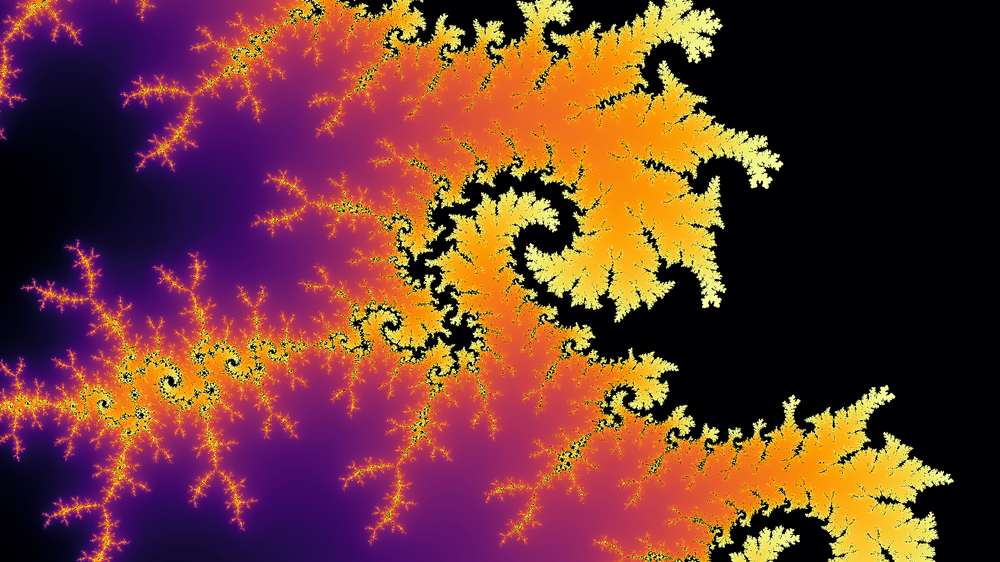

# Alexander Nicol: Portfolio

This repository highlights some projects that I have worked on. 

## Maths visualizations
### Interactive zoom into Mandelbrot set

### Cellular automata
|  |  |  |
### Maze generation
### Primordial particles
### Prime spirals
