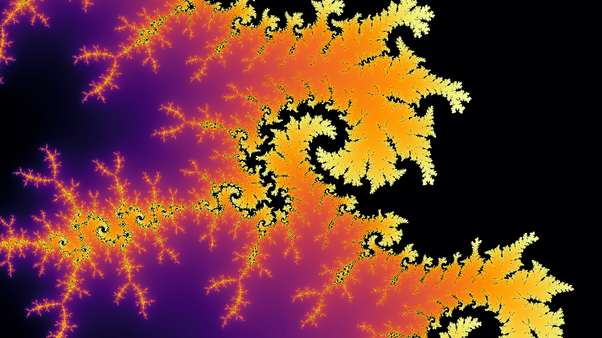
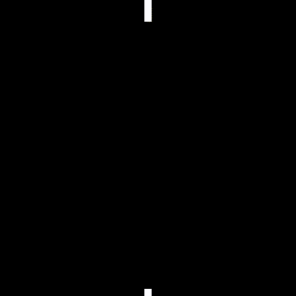
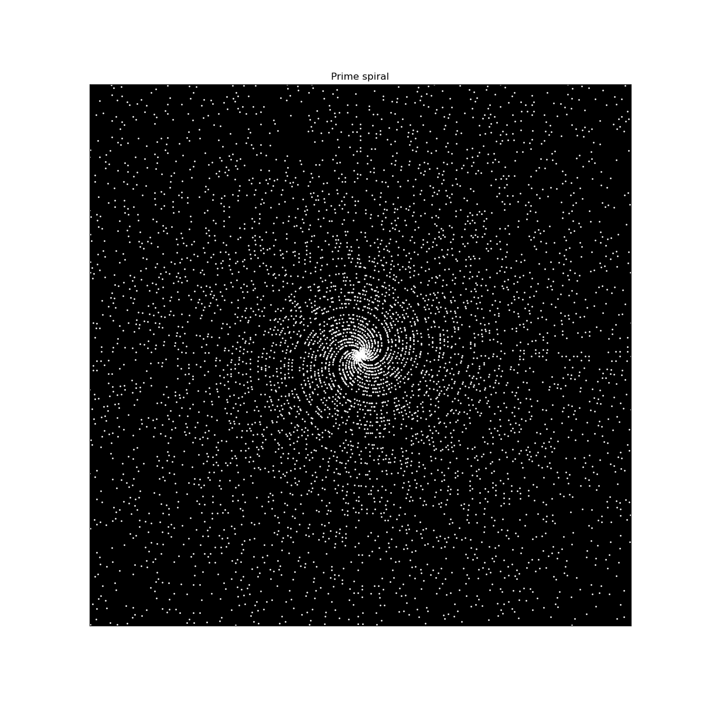

# Alexander Nicol: Portfolio

This repository highlights some projects that I have worked on.

## Table of Contents
- [Kaggle Competition: Regression with an Insurance Dataset](#kaggle-competition-regression-with-an-insurance-dataset)
- [Maths visualizations](#maths-visualizations)

## Kaggle Competition: Regression with an Insurance Dataset

## Maths visualizations
### Interactive zoom into Mandelbrot set
This script allows the user to repeatedly click on regions of the Mandelbrot set to zoom in closer.

### Cellular automata
This folder contains Python scripts for Conway's Game of Life and Langton's Ant, visualized in pygame with user-provided starting conditions. Langton's Ant is generalized to multiple colours and multiple ants.

  
  
  

### Maze generation
This script explored an approach to blind generation of a maze, given an entrance and exit. A random walk path is generated to reach the exit, and then additional paths are added until the maze is filled to a specified amount.

### Primordial particles
Particle simulation based on ideas as discussed here: https://www.youtube.com/watch?v=makaJpLvbow

### Prime spirals
Identifying patterns in prime numbers based on ideas from Numberphile and other sources

