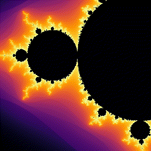

# Alexander Nicol: Portfolio

## Table of Contents
- [Kaggle Competition: Regression with an Insurance Dataset](#kaggle-competition-regression-with-an-insurance-dataset)
- [PhD chapter: Predicting severe side effects of radiotherapy using multi-organ, multi-omic features](#phd-chapter-predicting-severe-side-effects-of-radiotherapy-using-multi-organ-multi-omic-features)
- [Maths visualizations](#maths-visualizations)

## Kaggle Competition: Regression with an Insurance Dataset
<a href="https://www.kaggle.com/competitions/playground-series-s4e12/overview">Link to Kaggle page</a>

This 2024 challenge had the objective of predicting insurance premiums based on customer data, based on a dataset of over 1 million samples. 

I entered the competition and developed a machine learning model after performing exploratory data analysis. I achieved rank #234/1394 (top 17% of entries), demonstrating the ability to develop a high-scoring model (updated 19/12/2024).

<a href="https://github.com/xelanicol/Portfolio/blob/main/Kaggle_regression_insurance/kaggle_regression_insurance_keep_native_categorical_keep_NA.md">Link to Jupyter Notebook</a>

## PhD chapter: Predicting severe side effects of radiotherapy using multi-organ, multi-omic features

<a href="https://link.springer.com/article/10.1007/s11547-024-01901-z">Link to Publication</a>

I developed and externally validated a multi-omic model with combined clinical, radiomic and dosiomic features, achieving superior pre-treatment prediction of severe oral mucositis in nasopharyngeal carcinoma patients undergoing radiotherapy compared to conventional approaches (16% improvement in external validation AUC).

The model harnessed features extracted from pre-treatment CT scans, radiotherapy dose distributions and clinical features. A deep learning auto-segmentation model was harnessed to supplement the set of organ contours included for feature extraction.

## Maths visualizations
### Interactive zoom into Mandelbrot set
This script allows the user to repeatedly click on regions of the Mandelbrot set to zoom in closer.

### Cellular automata
This folder contains Python scripts for Conway's Game of Life and Langton's Ant, visualized in pygame with user-provided starting conditions. Langton's Ant is generalized to multiple colours and multiple ants.

  
  
  

### Maze generation
This script explored an approach to blind generation of a maze, given an entrance and exit. A random walk path is generated to reach the exit, and then additional paths are added until the maze is filled to a specified amount.

### Primordial particles
Particle simulation based on ideas as discussed <a href="https://www.youtube.com/watch?v=makaJpLvbow">here</a>

### Prime spirals
Identifying patterns in prime numbers based on ideas from Numberphile and other sources

