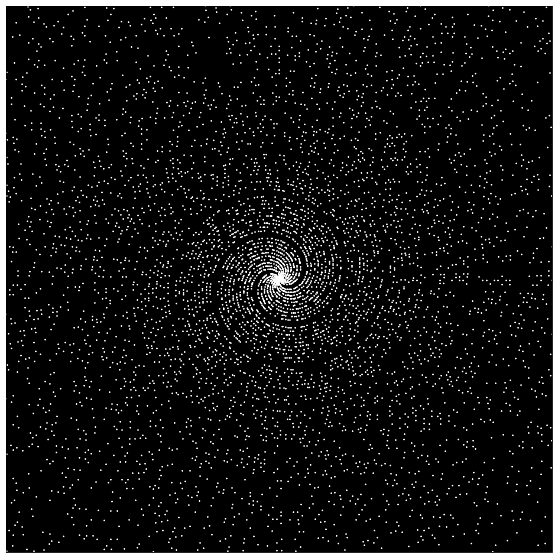

# Alexander Nicol: Portfolio

This repository highlights some projects that I have worked on.

## Table of Contents
- [Maths visualizations](#Maths visualizations)

## Maths visualizations
### Interactive zoom into Mandelbrot set

### Cellular automata
|  |  |  |
### Maze generation

### Primordial particles

### Prime spirals

